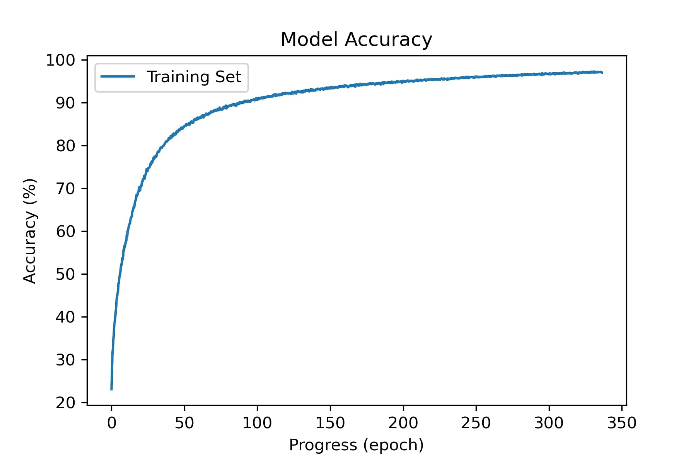

# Result_RAVDESS
The result of the model "DL_AutEmo82.CNN" on the RAVDESS dataset. 

The following chart shows the progress of our model while it trained on the RAVDESS dataset. The model had: four convolutional layers, four batch normalization layers, and a softmax output layer. Each convolutional layer had 300 nodes, and each normalization layer had 150 nodes. The last accuracy recorded is 97% on the training data which consisted of 3-second chunks. The whole RAVDESS set was used for training the model. The batch size was 24. 

